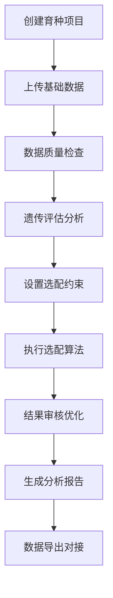

# 伊利奶牛选配系统 - 开发指导文档

## 📋 项目概述

**项目名称**：伊利奶牛选配系统 (Genetic Improve)
**项目位置**：`/Users/bozhenwang/projects/mating/genetic_improve`
**Git仓库**：`https://github.com/Barton0411/genetic_improve.git`
**当前版本**：v1.1.0.1 (2025-09-19) - API架构重构，PyMySQL替代SQLAlchemy
**目标版本**：v2.0.0
**主要分支**：main
**开发者**：伊利育种中心 王波臻（独立开发）
**测试团队**：繁育系统工程师（整体测试）

### 项目定位
专业的奶牛遗传改良和选配管理系统，集成数据分析、遗传评估、选配推荐等功能。基于PyQt6开发，支持Windows和macOS双平台。

---

## 🎯 业务需求定义

### 核心业务功能
1. **育种项目管理** - 多项目并行管理，独立数据存储
2. **数据上传分析** - 母牛、公牛、配种记录、体型外貌、基因组数据
3. **遗传评估** - 产奶量、乳脂率、乳蛋白率等关键性状分析
4. **选配优化** - 智能选配算法，优化后代遗传潜力，近交系数控制
5. **报告生成** - PPT自动报告、Excel导出、选配结果可视化
6. **系统集成** - 大平台对接API、多牧场数据区分管理

### 业务工作流程


---

## 🏗️ 技术架构

### 系统架构图
```
┌─────────────────────────────────────────────────────────────┐
│                    伊利奶牛选配系统                            │
├─────────────────────────────────────────────────────────────┤
│ 客户端 (PyQt6 Desktop App)                                   │
│ ├── GUI界面层        ├── 业务逻辑层        ├── 数据访问层         │
│ │   ├── 登录注册       │   ├── 遗传计算       │   ├── API客户端      │
│ │   ├── 项目管理       │   ├── 选配算法       │   ├── 本地缓存       │
│ │   ├── 数据上传       │   ├── 报告生成       │   └── 文件管理       │
│ │   ├── 结果展示       │   └── 版本更新       │                    │
│ │   └── 系统设置       │                    │                    │
├─────────────────────────────────────────────────────────────┤
│ 云端服务 (阿里云)                                             │
│ ├── API网关 (Nginx) - https://api.genepop.com              │
│ │   ├── /api/version/* → 版本检查服务 (端口8080)              │
│ │   ├── /api/auth/*    → 认证服务 (端口8081)                 │
│ │   └── /api/data/*    → 数据服务 (端口8082)                 │
│ ├── 数据存储                                                │
│ │   ├── PolarDB MySQL (业务数据)                            │
│ │   └── OSS对象存储 (安装包、报告文件)                        │
│ └── 基础设施                                                │
│     ├── ECS服务器 (39.96.189.27)                           │
│     ├── 域名SSL (api.genepop.com)                          │
│     └── CI/CD (GitHub Actions)                             │
└─────────────────────────────────────────────────────────────┘
```

### 技术栈选择

#### 前端技术栈
```python
# GUI框架
PyQt6>=6.4.0                    # 现代化跨平台GUI框架

# 数据处理
pandas>=2.0.0                   # 数据分析和处理
numpy>=1.24.0                   # 科学计算基础
scipy>=1.10.0                   # 科学计算高级功能

# 可视化
matplotlib>=3.7.0               # 基础图表绘制
seaborn>=0.12.0                 # 统计图表美化
networkx>=3.0.0                 # 血缘关系图网络分析

# 报告生成
python-pptx>=0.6.21            # PPT报告自动生成
openpyxl>=3.1.0                # Excel文件处理
xlsxwriter>=3.1.0              # Excel高级功能

# 机器学习
scikit-learn>=1.3.0            # 遗传评估算法
```

#### 后端技术栈
```python
# API框架
FastAPI>=0.104.0               # 高性能API框架
uvicorn>=0.24.0                # ASGI服务器

# 数据库
pymysql>=1.0.0                 # MySQL驱动（直接使用，不再依赖SQLAlchemy）
# sqlalchemy>=2.0.0            # (已移除) ORM框架 - 使用PyMySQL直接操作
# alembic>=1.12.0              # (已移除) 数据库迁移工具

# 认证安全
PyJWT>=2.8.0                   # JWT令牌管理
cryptography>=41.0.0           # 加密解密
passlib>=1.7.4                 # 密码哈希

# 网络通信
requests>=2.31.0               # HTTP客户端
httpx>=0.25.0                  # 异步HTTP客户端
```

---

## 🔄 重要更新 (v1.1.0.1)

### 2025-09-19 API架构重构

#### 主要改动
1. **移除SQLAlchemy依赖**
   - 原因：SQLAlchemy的事务管理导致"Transaction already initialized"错误
   - 解决方案：使用PyMySQL直接操作数据库
   - 影响：简化了数据库操作逻辑，提高了稳定性

2. **数据库连接优化**
   - 从硬编码IP地址改为使用域名：`defectgene-new.mysql.polardb.rds.aliyuncs.com`
   - 数据库名：`bull_library`
   - 用户名：`defect_genetic_checking`

3. **API服务配置**
   - 认证API：端口8081，使用systemd服务管理
   - 服务文件：`/etc/systemd/system/genetic-auth-api.service`
   - 日志查看：`sudo journalctl -u genetic-auth-api -f`

#### 技术细节
```python
# 旧方式 (SQLAlchemy) - 已废弃
engine = create_engine(DATABASE_URL)
with engine.connect() as connection:
    trans = connection.begin()  # 这里会导致事务冲突

# 新方式 (PyMySQL) - 推荐使用
connection = pymysql.connect(**DATABASE_CONFIG)
connection.begin()  # 简单直接的事务管理
```

---

## 📊 数据库设计

### 核心数据表结构

#### 用户认证表
```sql
-- 用户登录表 (现有，不修改)
CREATE TABLE `id-pw` (
    ID VARCHAR(50) PRIMARY KEY COMMENT '工号，作为登录账号',
    PW VARCHAR(255) NOT NULL COMMENT '登录密码',
    name VARCHAR(100) COMMENT '用户真实姓名',
    created_at TIMESTAMP DEFAULT CURRENT_TIMESTAMP,
    updated_at TIMESTAMP DEFAULT CURRENT_TIMESTAMP ON UPDATE CURRENT_TIMESTAMP
) ENGINE=InnoDB DEFAULT CHARSET=utf8mb4 COMMENT='用户认证表';

-- 邀请码表 (现有，不修改)
CREATE TABLE invitation_codes (
    id BIGINT PRIMARY KEY AUTO_INCREMENT,
    code VARCHAR(32) NOT NULL UNIQUE COMMENT '邀请码',
    status TINYINT DEFAULT 1 COMMENT '状态：1-有效，0-无效',
    creator_id BIGINT COMMENT '创建者ID',
    used_by_user_id BIGINT COMMENT '使用者ID',
    max_uses INT DEFAULT 1 COMMENT '最大使用次数',
    current_uses INT DEFAULT 0 COMMENT '当前使用次数',
    expire_time DATETIME COMMENT '过期时间，NULL表示永不过期',
    created_at TIMESTAMP DEFAULT CURRENT_TIMESTAMP,
    updated_at TIMESTAMP DEFAULT CURRENT_TIMESTAMP ON UPDATE CURRENT_TIMESTAMP,
    used_at TIMESTAMP COMMENT '使用时间',
    remark VARCHAR(255) COMMENT '备注说明',
    INDEX idx_code (code),
    INDEX idx_status_expire (status, expire_time)
) ENGINE=InnoDB DEFAULT CHARSET=utf8mb4 COMMENT='邀请码管理表';
```

#### 业务数据表 (需要扩展)
```sql
-- 选配结果表 (需要添加牧场站号字段)
ALTER TABLE mating_results
ADD COLUMN result_farm_code VARCHAR(20) COMMENT '牧场站号标识',
ADD INDEX idx_farm_code (result_farm_code),
ADD INDEX idx_farm_user (result_farm_code, user_id);

-- 项目表 (如果不存在则创建)
CREATE TABLE projects (
    id BIGINT PRIMARY KEY AUTO_INCREMENT,
    project_name VARCHAR(100) NOT NULL COMMENT '项目名称',
    farm_code VARCHAR(20) COMMENT '所属牧场代码',
    user_id VARCHAR(50) NOT NULL COMMENT '创建用户',
    description TEXT COMMENT '项目描述',
    status ENUM('active', 'completed', 'archived') DEFAULT 'active',
    created_at TIMESTAMP DEFAULT CURRENT_TIMESTAMP,
    updated_at TIMESTAMP DEFAULT CURRENT_TIMESTAMP ON UPDATE CURRENT_TIMESTAMP,
    FOREIGN KEY (user_id) REFERENCES `id-pw`(ID),
    INDEX idx_user_farm (user_id, farm_code),
    INDEX idx_status (status)
) ENGINE=InnoDB DEFAULT CHARSET=utf8mb4 COMMENT='育种项目表';
```

#### 新增API相关表
```sql
-- API访问日志表
CREATE TABLE api_access_logs (
    id BIGINT PRIMARY KEY AUTO_INCREMENT,
    user_id VARCHAR(50) COMMENT '用户ID',
    endpoint VARCHAR(200) NOT NULL COMMENT 'API端点',
    method VARCHAR(10) NOT NULL COMMENT 'HTTP方法',
    ip_address VARCHAR(45) COMMENT '客户端IP',
    user_agent TEXT COMMENT '用户代理',
    request_data JSON COMMENT '请求数据',
    response_code INT COMMENT 'HTTP响应码',
    response_time_ms INT COMMENT '响应时间(毫秒)',
    error_message TEXT COMMENT '错误信息',
    created_at TIMESTAMP DEFAULT CURRENT_TIMESTAMP,
    INDEX idx_user_time (user_id, created_at),
    INDEX idx_endpoint (endpoint),
    INDEX idx_response_code (response_code)
) ENGINE=InnoDB DEFAULT CHARSET=utf8mb4 COMMENT='API访问日志表';

-- 系统配置表
CREATE TABLE system_configs (
    id INT PRIMARY KEY AUTO_INCREMENT,
    config_key VARCHAR(50) NOT NULL UNIQUE COMMENT '配置键',
    config_value TEXT COMMENT '配置值',
    description VARCHAR(200) COMMENT '配置说明',
    is_encrypted TINYINT DEFAULT 0 COMMENT '是否加密存储',
    created_at TIMESTAMP DEFAULT CURRENT_TIMESTAMP,
    updated_at TIMESTAMP DEFAULT CURRENT_TIMESTAMP ON UPDATE CURRENT_TIMESTAMP,
    INDEX idx_key (config_key)
) ENGINE=InnoDB DEFAULT CHARSET=utf8mb4 COMMENT='系统配置表';
```

---

## 🛠️ 开发规则与规范

### 代码组织规范

#### 目录结构标准
```
genetic_improve/
├── auth/                       # 认证模块 (新增)
│   ├── __init__.py
│   ├── auth_service.py         # 认证服务
│   ├── token_manager.py        # 令牌管理 (待开发)
│   └── api_client.py           # API客户端 (待开发)
├── core/                       # 核心功能模块
│   ├── config/                 # 配置管理
│   ├── data/                   # 数据处理
│   │   ├── update_manager.py   # 🚨 包含硬编码密码，需重构
│   │   └── api_client.py       # 数据API客户端 (待开发)
│   ├── genetics/               # 遗传学计算
│   ├── mating/                 # 选配算法
│   ├── reports/                # 报告生成
│   │   ├── ppt_generator.py    # PPT生成 (已实现)
│   │   └── excel_generator.py  # Excel生成 (待开发)
│   └── update/                 # 版本更新系统 ✅
├── gui/                        # 用户界面
│   ├── main_window.py          # 主窗口
│   ├── login_dialog.py         # 登录对话框 ✅ 已添加注册功能
│   ├── register_dialog.py      # 注册对话框 ✅
│   ├── splash_screen.py        # 启动画面
│   └── components/             # UI组件
├── api/                        # API相关 (新增目录)
│   ├── __init__.py
│   ├── client.py               # API客户端封装
│   ├── models.py               # API数据模型
│   └── exceptions.py           # API异常定义
├── utils/                      # 工具模块
├── tests/                      # 测试用例
├── docs/                       # 文档
│   ├── DEVELOPMENT_GUIDE.md    # 本文档
│   ├── api_migration_plan.md   # API化改造计划
│   └── deployment/             # 部署文档
├── scripts/                    # 脚本工具
│   ├── create_invitation_table.py  # 邀请码表创建
│   └── database_migration.py  # 数据库迁移脚本
├── requirements.txt            # 生产依赖
├── requirements-dev.txt        # 开发依赖
└── main.py                     # 应用入口
```

#### 命名规范
```python
# 文件命名：下划线分隔
auth_service.py, token_manager.py, api_client.py

# 类命名：驼峰式
class AuthService, class TokenManager, class APIClient

# 函数命名：下划线分隔
def get_user_info(), def validate_token(), def create_access_token()

# 常量命名：全大写下划线分隔
JWT_SECRET_KEY, API_BASE_URL, TOKEN_EXPIRE_HOURS

# 变量命名：下划线分隔
user_info, access_token, api_response
```

### API设计规范

#### RESTful API规范
```python
# URL设计规范
POST   /api/auth/login              # 用户登录
POST   /api/auth/register           # 用户注册
GET    /api/auth/profile            # 获取用户信息
POST   /api/auth/refresh            # 刷新令牌
POST   /api/auth/logout             # 用户登出

GET    /api/data/projects           # 获取项目列表
POST   /api/data/projects           # 创建新项目
GET    /api/data/projects/{id}      # 获取项目详情
PUT    /api/data/projects/{id}      # 更新项目信息
DELETE /api/data/projects/{id}      # 删除项目

POST   /api/mating/results          # 提交选配结果
GET    /api/mating/results          # 查询选配结果
GET    /api/mating/results/{id}     # 获取特定结果

GET    /api/version/latest          # 版本检查 (现有)
GET    /api/health                  # 健康检查
```

#### 响应格式标准
```python
# 成功响应格式
{
    "success": true,
    "message": "操作成功",
    "data": {
        # 具体数据
    },
    "timestamp": 1695789123
}

# 错误响应格式
{
    "success": false,
    "message": "详细错误描述",
    "error_code": "AUTH_001",     # 错误代码
    "details": {                  # 详细错误信息 (可选)
        "field": "username",
        "reason": "用户名不能为空"
    },
    "timestamp": 1695789123
}

# 分页响应格式
{
    "success": true,
    "message": "查询成功",
    "data": {
        "items": [...],           # 数据项
        "pagination": {
            "page": 1,
            "size": 20,
            "total": 100,
            "pages": 5
        }
    },
    "timestamp": 1695789123
}
```

### 安全开发规范

#### 认证授权规范
```python
# JWT令牌配置
JWT_SECRET_KEY: str         # 生产环境必须使用强密钥
JWT_ALGORITHM = "HS256"     # 加密算法
JWT_EXPIRE_HOURS = 24       # 令牌有效期

# API安全规范
1. 所有API端点必须支持HTTPS
2. 敏感操作需要令牌验证
3. 令牌过期后需要重新登录
4. 记录所有API访问日志
5. 实现API调用频率限制
```

#### 数据安全规范
```python
# 密码安全
1. 数据库密码必须存储在环境变量
2. 客户端代码不能包含任何数据库连接信息
3. 用户密码使用哈希存储 (未来考虑bcrypt)
4. 传输层强制使用HTTPS加密

# 日志安全
1. 记录用户操作但不记录密码
2. 敏感数据脱敏处理
3. 定期清理过期日志
```

---

## 📋 待处理任务清单

### 🔥 紧急优先级任务

#### 1. API化安全改造 (当前进行中)
**状态**：🔄 进行中
**预计工期**：3-4天
**风险等级**：🚨 高 (安全漏洞)

**子任务**：
- [ ] **服务器环境变量配置** (1天)
  - [ ] 数据库密码迁移到环境变量
  - [ ] JWT密钥生成和配置
  - [ ] 服务器重启测试

- [ ] **认证API服务开发** (2天)
  - [ ] FastAPI框架搭建
  - [ ] 登录接口开发 `POST /api/auth/login`
  - [ ] 注册接口开发 `POST /api/auth/register`
  - [ ] 用户信息接口 `GET /api/auth/profile`
  - [ ] JWT令牌验证中间件

- [ ] **Nginx路径分发配置** (半天)
  - [ ] 添加 `/api/auth/*` 路由规则
  - [ ] SSL证书验证
  - [ ] 负载测试

- [ ] **客户端API化改造** (1天)
  - [ ] 创建 `api/client.py` HTTP客户端
  - [ ] 修改 `auth/auth_service.py` 使用API
  - [ ] 移除 `core/data/update_manager.py` 硬编码连接
  - [ ] 令牌本地缓存管理

**验收标准**：
- ✅ 客户端代码中完全没有数据库密码
- ✅ 登录注册功能正常工作
- ✅ 令牌24小时后自动过期
- ✅ API调用失败有友好提示

#### 2. 选配结果API + 牧场站号字段
**状态**：⏳ 待开始
**预计工期**：2-3天
**依赖**：API化改造完成后开始

**子任务**：
- [ ] **数据库字段扩展**
  ```sql
  ALTER TABLE mating_results
  ADD COLUMN result_farm_code VARCHAR(20) COMMENT '牧场站号';
  ```
- [ ] **选配结果API开发**
  - [ ] `POST /api/mating/results` 提交选配结果
  - [ ] `GET /api/mating/results` 查询选配结果 (支持牧场筛选)
  - [ ] `GET /api/mating/results/{id}` 获取详细结果
- [ ] **客户端适配**
  - [ ] 选配结果提交时添加牧场站号
  - [ ] 结果查询界面支持牧场筛选
  - [ ] 批量导出添加牧场信息

### 🟡 中等优先级任务

#### 3. 体型外貌鉴定模块重构
**状态**：⏳ 待开始
**预计工期**：4-5天
**当前状态**：在v1.1.0.0中标记为"暂未开放，重构中"

**技术要求**：
- [ ] 重新实现自动分析功能
- [ ] 集成可视化和报告生成
- [ ] 体型评分算法优化
- [ ] 外貌指标分析增强
- [ ] 与主系统数据流集成

#### 4. Excel报告生成功能
**状态**：⏳ 待开始
**预计工期**：2-3天
**当前状态**：只有PPT报告，需要添加Excel格式

**技术要求**：
- [ ] 创建 `core/reports/excel_generator.py`
- [ ] 支持多种Excel模板
- [ ] 数据透视表和图表自动生成
- [ ] 与现有PPT报告系统保持一致性
- [ ] 用户界面添加Excel导出选项

### 🟢 低优先级任务

#### 5. 系统优化和增强
- [ ] **性能优化**
  - [ ] 大数据集处理优化
  - [ ] 内存使用优化
  - [ ] 数据库查询优化
- [ ] **测试覆盖**
  - [ ] 单元测试编写
  - [ ] 集成测试
  - [ ] 性能测试
- [ ] **文档完善**
  - [ ] API文档生成
  - [ ] 用户手册更新
  - [ ] 开发者文档

---

## 📚 重要技术信息

### 服务器环境配置

#### 生产服务器信息
```bash
# 服务器连接信息
主机: 39.96.189.27
用户: ecs-user
SSH密钥: ~/Downloads/genetic_improvement.pem
操作系统: Ubuntu 24.04 64位
Python版本: 3.12.3

# 连接命令
ssh -i ~/Downloads/genetic_improvement.pem ecs-user@39.96.189.27
```

#### 域名和SSL配置
```
主域名: api.genepop.com
SSL证书: Let's Encrypt (自动续期)
到期时间: 2025-12-15
证书路径: /etc/letsencrypt/live/api.genepop.com/

当前路由:
├── api.genepop.com/api/version/* → 版本检查 (8080端口)
└── api.genepop.com/api/auth/*    → 认证服务 (8081端口) [待添加]
```

#### 数据库连接信息
```python
# 🚨 当前硬编码配置 (需要迁移到环境变量)
CLOUD_DB_HOST = 'defectgene-new.mysql.polardb.rds.aliyuncs.com'
CLOUD_DB_PORT = 3306
CLOUD_DB_USER = 'defect_genetic_checking'
CLOUD_DB_PASSWORD = '********'  # 🚨 安全风险
CLOUD_DB_NAME = 'bull_library'

# ✅ 目标环境变量配置
export DB_HOST="defectgene-new.mysql.polardb.rds.aliyuncs.com"
export DB_PORT="3306"
export DB_USER="defect_genetic_checking"
export DB_PASSWORD="********"
export DB_NAME="bull_library"
export JWT_SECRET="生产环境强密钥"
```

#### 测试数据
```python
# 可用邀请码 (用于开发测试)
邀请码: DHI2025-30    (剩余30次使用, 过期: 2025-10-01)
邀请码: DHI2025-20    (剩余19次使用, 过期: 2025-10-01)
邀请码: DHI2025-10    (剩余9次使用, 过期: 2025-10-01)

# 测试用户账号
用户名: 12345         (密码: 请向用户确认)
```

### 本地开发环境

#### 开发工具配置
```bash
# 项目根目录
cd /Users/bozhenwang/projects/mating/genetic_improve

# Python环境
Python版本: 3.9+
虚拟环境: ./venv (如果存在)

# 依赖安装
pip install -r requirements.txt

# 应用启动
python main.py

# 应用日志位置
~/.genetic_improve/app_debug.log
```

#### 常用调试命令
```bash
# API健康检查
curl https://api.genepop.com/api/health

# 版本检查测试
curl https://api.genepop.com/api/version/latest

# 查看服务状态
ssh -i ~/Downloads/genetic_improvement.pem ecs-user@39.96.189.27 "ps aux | grep python"

# 查看服务日志
ssh -i ~/Downloads/genetic_improvement.pem ecs-user@39.96.189.27 "tail -f /home/ecs-user/version_check_api.log"
```

---

## ⚠️ 风险管理

### 技术风险

#### 高风险项目
1. **数据库密码泄露** 🚨
   - **风险**：客户端硬编码密码，任何人都能获取完整数据库访问权限
   - **影响**：数据泄露、系统被攻击、业务中断
   - **缓解**：立即实施API化改造，移除客户端数据库连接

2. **版本检查服务中断** 🚨
   - **风险**：API化改造过程中可能影响现有版本检查功能
   - **影响**：用户无法正常更新，新用户无法下载
   - **缓解**：保持8080端口服务独立运行，新增8081端口认证服务

3. **数据迁移失败** 🟡
   - **风险**：添加牧场站号字段时可能影响现有数据
   - **影响**：历史数据丢失，业务连续性中断
   - **缓解**：先备份数据，使用事务执行，准备回滚方案

#### 业务风险
1. **用户体验下降** 🟡
   - **风险**：API化后网络依赖增加，离线无法使用
   - **影响**：用户满意度下降，使用频率减少
   - **缓解**：实现优雅降级，重要功能提供离线模式

2. **性能衰减** 🟡
   - **风险**：API调用增加网络延迟
   - **影响**：软件响应变慢，用户操作效率降低
   - **缓解**：实现本地缓存，优化API响应时间

### 开发风险

#### 进度风险
1. **API开发复杂度低估** 🟡
   - **当前预估**：3-4天完成API化改造
   - **潜在问题**：认证逻辑复杂，测试用例多
   - **缓解措施**：分阶段开发，优先保证核心功能

2. **并行开发冲突** 🟡
   - **风险**：多个功能同时开发可能产生代码冲突
   - **缓解**：明确模块边界，按优先级顺序开发

#### 质量风险
1. **测试覆盖不足** 🟡
   - **当前状态**：缺少自动化测试
   - **风险**：功能回归，新Bug引入
   - **缓解**：关键功能手动测试，逐步补充自动化测试

---

## 🔧 调试与故障排除

### 常见问题诊断

#### API连接问题
```python
# 问题：客户端无法连接API
# 排查步骤：
1. 检查网络连接: ping api.genepop.com
2. 检查SSL证书: curl -I https://api.genepop.com/api/health
3. 检查服务状态: ssh服务器查看进程
4. 检查防火墙: 确认8081端口开放
5. 查看错误日志: 客户端和服务器日志分析
```

#### 认证问题
```python
# 问题：登录失败或令牌无效
# 排查步骤：
1. 验证用户名密码是否正确
2. 检查令牌是否过期 (24小时)
3. 验证JWT密钥配置
4. 查看API访问日志
5. 检查数据库连接状态
```

#### 数据同步问题
```python
# 问题：数据不一致或丢失
# 排查步骤：
1. 检查数据库事务完整性
2. 验证API请求参数
3. 查看数据库约束错误
4. 检查并发访问冲突
5. 确认备份恢复点
```

### 监控和日志

#### 关键监控指标
```python
# 服务器监控
CPU使用率: <80%
内存使用率: <85%
磁盘使用率: <90%
网络延迟: <100ms

# API监控
响应时间: <2秒
成功率: >99%
并发用户: 100+
错误率: <1%

# 业务监控
日活跃用户数
功能使用频率
报告生成成功率
数据上传成功率
```

#### 日志文件位置
```bash
# 客户端日志
~/.genetic_improve/app_debug.log

# 服务器日志
/home/ecs-user/version_check_api.log        # 版本检查服务
/home/ecs-user/auth_api.log                 # 认证服务 (待创建)
/var/log/nginx/access.log                   # Nginx访问日志
/var/log/nginx/error.log                    # Nginx错误日志

# 系统日志
sudo journalctl -u genetic-api -f           # 服务状态日志
```

---

## 📈 版本规划

### 版本发布计划

#### v2.0.0 - API化安全版本 (目标：2025-09-20)
**主要特性**：
- ✅ 移除客户端硬编码数据库连接
- ✅ 实现JWT令牌认证系统
- ✅ 新增用户注册功能
- ✅ API化登录认证
- ✅ 牧场站号字段支持

**向后兼容性**：
- 保持现有功能不变
- 用户数据无缝迁移
- 界面操作保持一致

#### v2.1.0 - 报告增强版本 (目标：2025-10-01)
**主要特性**：
- Excel报告生成功能
- 体型外貌鉴定模块重构
- 报告模板多样化
- 性能优化

#### v2.2.0 - 平台集成版本 (目标：2025-10-15)
**主要特性**：
- 完整的选配结果API
- 第三方平台对接接口
- 数据同步机制
- 高级权限管理

### 技术债务清理计划

#### 高优先级技术债务
1. **安全漏洞**：硬编码数据库密码 (v2.0.0解决)
2. **架构混乱**：直连数据库模式 (v2.0.0解决)
3. **缺少测试**：自动化测试覆盖 (v2.1.0开始)

#### 中优先级技术债务
1. **性能问题**：大数据集处理优化 (v2.1.0)
2. **代码重复**：公共模块抽象 (v2.2.0)
3. **文档缺失**：API文档完善 (v2.0.0)

---

## ✅ 质量保证体系

### 功能测试清单
**原则**：简单实用，15分钟完成核心验证

#### 发布前必测功能
```bash
# 1. 认证功能测试
□ 用户注册：使用邀请码DHI2025-30注册新用户
□ 用户登录：使用注册账号登录成功
□ 令牌验证：登录后24小时内功能正常使用
□ 令牌过期：24小时后需要重新登录

# 2. 核心业务功能
□ 项目创建：新建育种项目
□ 数据上传：上传母牛、公牛数据
□ 选配推荐：执行选配算法获得结果
□ 报告生成：生成PPT报告

# 3. 版本更新功能
□ 版本检查：启动时自动检查更新
□ 强制更新：老版本强制更新提示
```

#### API接口测试命令
```bash
# 健康检查
curl https://api.genepop.com/api/health

# 版本检查
curl https://api.genepop.com/api/version/latest

# 认证测试 (API化完成后)
curl -X POST https://api.genepop.com/api/auth/login \
  -H "Content-Type: application/json" \
  -d '{"username":"test_user","password":"test123"}'
```

---

## 🚀 部署发布SOP

### 标准部署流程
**目标**：10分钟内完成安全部署

#### 服务器端部署步骤
```bash
# 1. 连接服务器
ssh -i ~/Downloads/genetic_improvement.pem ecs-user@39.96.189.27

# 2. 备份当前版本
cp -r genetic_api genetic_api_backup_$(date +%Y%m%d_%H%M%S)

# 3. 部署新版本
# (根据具体更新内容执行相应步骤)

# 4. 重启服务
sudo systemctl restart genetic-api

# 5. 验证部署
curl -I https://api.genepop.com/api/health
```

#### 客户端发布步骤
```bash
# 1. 更新版本号
# 修改version.py中的版本号

# 2. 构建安装包
./trigger_build.sh x.x.x

# 3. 上传到OSS
# GitHub Actions自动完成

# 4. 更新version.json
# 更新OSS中的version.json文件

# 5. 数据库版本记录
# 在PolarDB中插入新版本记录
```

### 回滚应急方案
```bash
# 服务器回滚 (5分钟内完成)
1. 停止新版本服务: sudo systemctl stop genetic-api
2. 恢复备份版本: mv genetic_api_backup_xxx genetic_api
3. 启动旧版本: sudo systemctl start genetic-api
4. 验证服务: curl https://api.genepop.com/api/health

# 客户端回滚
1. 恢复旧版本的version.json
2. 用户可通过版本检查获取稳定版本
```

### 发布后检查清单
```bash
□ API健康检查返回200
□ 版本检查接口正常
□ 用户登录功能正常
□ 新功能基本验证通过
□ 监控指标无异常告警
```

---

## 📊 基础监控体系

### 关键监控指标
**原则**：监控最重要的，出问题能第一时间知道

#### 系统级监控
```bash
# 服务状态检查 (每5分钟)
curl -f https://api.genepop.com/api/health || echo "API服务异常"

# 响应时间监控 (告警阈值: >5秒)
curl -w "%{time_total}" https://api.genepop.com/api/version/latest

# 磁盘空间检查 (告警阈值: >90%)
df -h | grep -E "(9[0-9]%|100%)"
```

#### 业务级监控
```bash
# 用户登录成功率 (每日统计)
# 通过API访问日志分析登录成功/失败比例

# 版本检查调用量 (每日统计)
# 监控用户活跃度和版本分布

# 新用户注册量 (每日统计)
# 通过数据库查询注册用户数量
```

### 告警机制
```bash
# 简单邮件告警 (crontab配置)
# 每5分钟检查一次，异常时发送邮件
*/5 * * * * /home/ecs-user/scripts/health_check.sh

# 告警内容包括:
- 服务状态异常
- 响应时间过长
- 磁盘空间不足
- 数据库连接失败
```

---

## 📝 需求管理模板

### 功能需求文档模板
```markdown
## 需求标题: [简短描述]

### 需求背景
**问题描述**: 当前存在什么问题
**业务价值**: 解决后带来什么价值
**优先级**: 高/中/低

### 功能描述
**用户角色**: 谁会使用这个功能
**使用场景**: 在什么情况下使用
**功能流程**: 1-2-3步骤描述

### 验收标准
**必须实现**:
- [ ] 功能点1: 具体可验证的标准
- [ ] 功能点2: 具体可验证的标准

**可选实现**:
- [ ] 优化点1: 时间允许的情况下
- [ ] 优化点2: 时间允许的情况下

### 技术约束
**兼容性**: 需要兼容的版本/平台
**性能要求**: 响应时间、并发量等
**安全要求**: 特殊的安全考虑

### 工期评估
**预估工期**: X天
**风险因素**: 可能影响进度的因素
**依赖项**: 需要其他任务先完成
```

### 需求优先级评估
```python
# 优先级矩阵 (紧急程度 × 重要程度)
高优先级: 紧急且重要 (安全漏洞、系统崩溃)
中优先级: 重要但不紧急 (新功能、性能优化)
低优先级: 紧急但不重要 (界面优化、文档更新)

# 评估标准
影响用户数: 多/中/少
技术难度: 高/中/低
开发工期: 长/中/短
```

---

## 🏷️ 字段标准化管理（长期改进任务）

### 问题现状
- 同一数据有多个字段名：`cow_id`, `animal_id`, `cattle_id`, `BULL_NAAB`, `牛号`, `耳号`
- 中英文混用：数据库用英文，界面显示需要中文
- 维护困难：修改一处需要找遍所有相关代码

### 三层映射架构
```
多个原始字段 → 标准英文字段 → 中文显示名
cow_id/牛号/耳号 → cattle_id → "牛只编号"
```

### 映射配置示例
```python
# config/field_mappings.json
{
    "normalize_mappings": {
        "cattle_id": ["cow_id", "animal_id", "cattle_id", "BULL_NAAB", "牛号", "耳号"],
        "farm_code": ["farm_id", "站号", "牧场编号", "result_farm_code"],
        "birth_date": ["birth_date", "birthday", "出生日期", "birth_dt"],
        "milk_yield": ["milk_yield", "产奶量", "日产奶量", "milk_production"]
    },
    "display_mappings": {
        "cattle_id": "牛只编号",
        "farm_code": "牧场代码",
        "birth_date": "出生日期",
        "milk_yield": "产奶量"
    }
}
```

### 实施策略（渐进式）
1. **新功能开发**：必须使用标准字段名
2. **修改现有代码**：顺便统一字段名，不专门修改
3. **API接口**：输入支持多种字段名，输出使用标准字段名
4. **界面显示**：通过映射配置自动转换为中文

### 工具类设计
```python
# utils/field_mapper.py
class FieldMappingManager:
    def normalize_field(self, field_name: str) -> str:
        """将任意字段名转换为标准字段名"""

    def get_display_name(self, field_name: str) -> str:
        """获取字段的中文显示名"""

    def normalize_data(self, data: dict) -> dict:
        """标准化数据字典的字段名"""
```

### 执行计划
- **v2.0.0**：在API化改造时，新接口使用标准字段名
- **v2.1.0**：创建字段映射工具类
- **v2.2.0**：逐步改造数据上传模块
- **v2.3.0**：专项处理剩余模块的字段标准化

### 注意事项
- ✅ **不破坏现有功能**：通过映射工具保证兼容性
- ✅ **渐进改进**：不影响正常开发进度
- ✅ **配置驱动**：通过配置文件管理映射关系，不硬编码

---

## 📝 变更记录

| 版本 | 日期 | 变更内容 | 负责人 |
|------|------|----------|---------|
| v1.0 | 2025-09-17 | 初始版本创建，定义整体开发规范和任务清单 | 王波臻 |
| v1.1 | 2025-09-17 | 添加用户注册功能完成记录，更新API化改造状态 | 王波臻 |
| v1.1.0.1 | 2025-09-19 | API架构重构完成：移除SQLAlchemy依赖，使用PyMySQL直接连接数据库，解决事务管理问题 | 王波臻 |

---

**文档状态**：🔄 持续更新
**最后更新**：2025-09-19
**下一次审查**：2025-09-20
**维护负责人**：伊利育种中心 王波臻（独立开发） / 繁育系统工程师（整体测试）

---

> 💡 **使用说明**：本文档是伊利奶牛选配系统的核心开发指导文档，包含了项目的完整技术规范、开发规则、任务清单和重要信息。所有开发工作都应该以此文档为准，确保项目的一致性和可维护性。