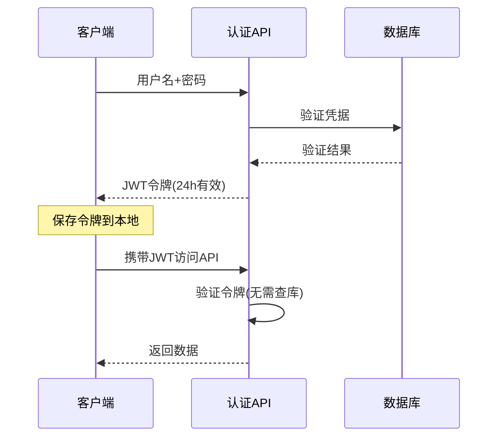

# 伊利奶牛选配系统 API 化改造开发文档

## 📋 项目概述

**目标**：将现有硬编码数据库连接方式改造为安全的 API 接口模式，解决数据库密码暴露的安全风险。

**当前版本**：v1.1.0.0
**目标版本**：v2.0.0
**开发周期**：2025-09-17 开始

---

## 🚨 核心安全问题

### 当前危险状况
```python
# 文件：core/data/update_manager.py:24
CLOUD_DB_PASSWORD_RAW = '********'  # 🚨 已移除硬编码密码，现使用环境变量
```

**风险分析**：
- ❌ 任何人反编译客户端都能获取数据库完整访问权限
- ❌ 密码变更需要重新发布所有客户端
- ❌ 无法监控和限制数据库访问
- ❌ 不符合企业级安全标准

---

## 🎯 需求定义

### 1. 功能需求

#### 1.1 认证功能
- [x] **用户注册**：邀请码验证 + 工号 + 姓名 + 密码
- [x] **用户登录**：工号 + 密码验证
- [ ] **令牌管理**：JWT 令牌生成、验证、刷新
- [ ] **用户资料**：获取当前用户信息

#### 1.2 数据访问API化
- [ ] **登录验证API**：替换直接数据库查询
- [ ] **注册验证API**：替换直接数据库插入
- [ ] **邀请码验证API**：集中管理邀请码逻辑
- [ ] **版本检查API**：保持现有功能不变

#### 1.3 客户端改造
- [ ] **移除数据库连接**：完全删除硬编码连接信息
- [ ] **HTTP API客户端**：实现API调用模块
- [ ] **令牌缓存**：本地安全存储令牌
- [ ] **网络异常处理**：API调用失败的降级策略

### 2. 非功能需求

#### 2.1 安全要求
- 🔒 数据库密码存储在服务器环境变量
- 🔐 JWT 令牌 24 小时自动过期
- 🛡️ HTTPS 强制加密传输
- 📊 API 调用日志记录

#### 2.2 性能要求
- ⚡ API 响应时间 < 2 秒
- 📈 支持 100+ 并发用户
- 💾 令牌验证无需查库

#### 2.3 兼容性要求
- 🔄 向后兼容现有用户数据
- 🖥️ 支持 Windows/macOS 双平台
- 📱 客户端升级无感知

---

## 🏗️ 技术架构

### 架构选择：统一域名 + 路径分发

```
客户端应用
    ↓ HTTPS
api.genepop.com
    ↓ Nginx 反向代理
├── /api/version/*  → 版本检查服务 (8080端口) ✅ 已存在
├── /api/auth/*     → 认证服务 (8081端口) 🔄 待开发
└── /api/data/*     → 数据服务 (8082端口) 🚀 未来扩展
```

### 认证方式：JWT 令牌



---

## 📊 数据库表结构

### 现有表（不修改）
```sql
-- 用户认证表
`id-pw` (
    ID VARCHAR(50) PRIMARY KEY,     -- 工号
    PW VARCHAR(255),                -- 密码
    name VARCHAR(100)               -- 姓名
)

-- 邀请码表
invitation_codes (
    id BIGINT PRIMARY KEY,
    code VARCHAR(32),               -- 邀请码
    status TINYINT,                 -- 状态：1-有效，0-无效
    max_uses INT,                   -- 最大使用次数
    current_uses INT,               -- 当前使用次数
    expire_time DATETIME            -- 过期时间
)
```

### 新增表（可选）
```sql
-- API访问日志
api_access_logs (
    id BIGINT PRIMARY KEY AUTO_INCREMENT,
    user_id VARCHAR(50),
    endpoint VARCHAR(200),
    method VARCHAR(10),
    ip_address VARCHAR(45),
    response_code INT,
    response_time_ms INT,
    created_at TIMESTAMP DEFAULT CURRENT_TIMESTAMP,
    INDEX idx_user_time (user_id, created_at),
    INDEX idx_endpoint (endpoint)
)
```

---

## 🛠️ 开发规则

### 1. 代码规范
```python
# API接口命名规范
POST /api/auth/login          # 用户登录
POST /api/auth/register       # 用户注册
GET  /api/auth/profile        # 获取用户信息
POST /api/auth/refresh        # 刷新令牌

# 响应格式标准
{
    "success": true,          # 布尔值，操作是否成功
    "message": "操作描述",     # 字符串，给用户的提示信息
    "data": {},              # 对象，实际数据
    "timestamp": 1695789123   # 时间戳
}

# 错误响应格式
{
    "success": false,
    "message": "详细错误信息",
    "error_code": "AUTH_001",  # 错误代码（可选）
    "timestamp": 1695789123
}
```

### 2. 安全规则
- 🔒 **密码传输**：仅支持 HTTPS，禁止 HTTP
- 🔑 **环境变量**：所有敏感信息使用环境变量
- 📝 **日志规则**：记录请求但不记录密码
- ⏰ **令牌管理**：24小时强制过期，无自动续期

### 3. 错误处理规则
```python
# 网络异常处理
try:
    response = api_client.call()
except ConnectionError:
    # 显示友好错误提示，提供重试选项
    show_error("网络连接失败，请检查网络后重试")
except TimeoutError:
    # 提供降级方案或重试机制
    show_error("请求超时，请稍后重试")
```

---

## 📅 开发计划

### 阶段1：服务器端安全化（优先级：🔥 紧急）
**时间**：1-2天

- [ ] **环境变量配置**
  ```bash
  export DB_HOST="defectgene-new.mysql.polardb.rds.aliyuncs.com"
  export DB_PASSWORD="********"  # 实际部署时设置真实密码
  export JWT_SECRET="生产环境复杂密钥"
  ```

- [ ] **认证API服务开发**
  - [ ] FastAPI应用框架搭建
  - [ ] JWT令牌生成和验证
  - [ ] 登录接口 `POST /api/auth/login`
  - [ ] 注册接口 `POST /api/auth/register`
  - [ ] 用户信息接口 `GET /api/auth/profile`

- [ ] **Nginx路径分发配置**
  ```nginx
  location /api/auth/ {
      proxy_pass http://localhost:8081;
  }
  ```

- [ ] **服务部署**
  - [ ] systemd服务配置
  - [ ] 开机自启动设置
  - [ ] 日志轮转配置

### 阶段2：客户端API化改造（优先级：🔥 高）
**时间**：2-3天

- [ ] **HTTP API客户端模块**
  ```python
  # 新建：api/api_client.py
  class APIClient:
      def login(username, password) -> (success, token, message)
      def register(employee_id, password, invite_code, name) -> (success, message)
      def get_profile() -> (success, user_info, message)
  ```

- [ ] **认证服务适配**
  ```python
  # 修改：auth/auth_service.py
  # 从数据库直连改为API调用
  ```

- [ ] **令牌管理模块**
  ```python
  # 新建：auth/token_manager.py
  class TokenManager:
      def save_token(token)         # 本地安全存储
      def get_token() -> token      # 获取本地令牌
      def is_token_valid() -> bool  # 检查令牌有效性
      def clear_token()             # 清除令牌
  ```

- [ ] **移除数据库连接**
  - [ ] 删除 `core/data/update_manager.py` 中的硬编码连接
  - [ ] 修改登录对话框使用API
  - [ ] 修改注册对话框使用API

### 阶段3：测试验证（优先级：🔥 高）
**时间**：1天

- [ ] **API功能测试**
  - [ ] 注册功能端到端测试
  - [ ] 登录功能端到端测试
  - [ ] 令牌过期处理测试
  - [ ] 网络异常处理测试

- [ ] **安全验证**
  - [ ] 确认客户端代码中无数据库密码
  - [ ] 确认HTTPS强制加密
  - [ ] 确认令牌正确过期

- [ ] **兼容性测试**
  - [ ] Windows平台测试
  - [ ] macOS平台测试
  - [ ] 现有用户数据兼容性

### 阶段4：生产部署（优先级：🟡 中）
**时间**：半天

- [ ] **生产环境配置**
  - [ ] 生产级JWT密钥生成
  - [ ] API服务监控配置
  - [ ] 错误告警设置

- [ ] **客户端发布**
  - [ ] 版本号更新到 v2.0.0
  - [ ] 构建和发布新版本
  - [ ] 用户升级通知

---

## 📚 重要技术信息

### 1. 服务器环境
- **服务器IP**：39.96.189.27
- **SSH密钥**：genetic_improvement.pem
- **用户**：ecs-user
- **操作系统**：Ubuntu 24.04
- **Python版本**：3.12.3
- **现有服务**：version_check_api.py (8080端口)

### 2. 数据库信息
```python
# 当前配置（需要迁移到环境变量）
CLOUD_DB_HOST = 'defectgene-new.mysql.polardb.rds.aliyuncs.com'
CLOUD_DB_PORT = 3306
CLOUD_DB_USER = 'defect_genetic_checking'
CLOUD_DB_PASSWORD = '********'  # 🚨 需要移除
CLOUD_DB_NAME = 'bull_library'
```

### 3. 域名和SSL
- **主域名**：api.genepop.com
- **SSL证书**：Let's Encrypt (自动续期)
- **到期时间**：2025-12-15

### 4. 测试邀请码
- `DHI2025-30`：30次使用额度，2025-10-01过期
- `DHI2025-20`：20次使用额度（已使用1次）
- `DHI2025-10`：10次使用额度（已使用1次）

---

## ⚠️ 风险与注意事项

### 1. 开发风险
- 🚨 **版本检查服务不能中断**：现有8080端口服务必须保持运行
- 🔒 **数据库密码泄露时间窗口**：在完成客户端改造前仍有风险
- 🌐 **网络依赖**：客户端将完全依赖网络连接

### 2. 部署风险
- 🔧 **Nginx配置错误**：可能导致所有API服务不可用
- 🔑 **环境变量丢失**：服务器重启可能导致认证失败
- 📊 **监控盲区**：新服务需要配置监控

### 3. 用户体验风险
- ⏰ **令牌过期**：24小时后需要重新登录
- 🌐 **网络问题**：离线状态下无法使用
- 🔄 **升级强制性**：旧版本将无法使用

---

## 🔧 开发调试信息

### 服务器连接
```bash
# SSH连接
ssh -i ~/Downloads/genetic_improvement.pem ecs-user@39.96.189.27

# 查看现有服务
ps aux | grep python
systemctl status genetic-api

# 查看日志
tail -f /home/ecs-user/version_check_api.log
```

### API测试命令
```bash
# 健康检查
curl https://api.genepop.com/api/health

# 版本检查（现有功能）
curl https://api.genepop.com/api/version/latest

# 登录测试（开发完成后）
curl -X POST https://api.genepop.com/api/auth/login \
  -H "Content-Type: application/json" \
  -d '{"username":"test_user","password":"test123"}'
```

### 本地开发
```bash
# 项目根目录
cd /Users/bozhenwang/projects/mating/genetic_improve

# 运行测试
python3 -m pytest tests/

# 启动应用
python3 main.py
```

---

## 📝 变更记录

| 日期 | 版本 | 变更内容 | 负责人 |
|------|------|----------|---------|
| 2025-09-17 | v1.0 | 初始版本，定义API化改造计划 | Claude |
| | | | |
| | | | |

---

**最后更新**：2025-09-17
**文档状态**：🔄 开发中
**下一步行动**：开始阶段1服务器端安全化改造